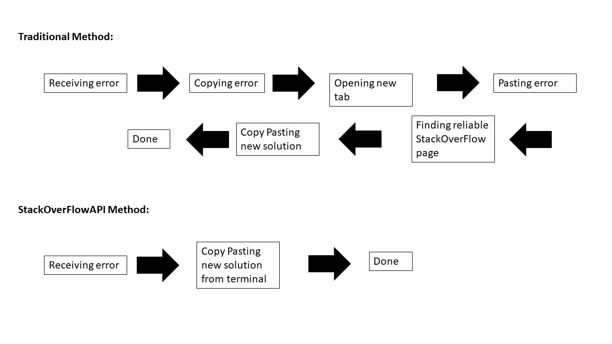

# PythonStackOverFlow

By importing this StackOverFlowAPI class, you are able to get direct error analysis on the problem you are facing at hand without having to open up another tab and copy and paste the error. 



Example of the StackOverFlowAPI:
```
try:
    a = 1
    b = 0
    c = a/b
except Exception as e:
    StackOverflowAPI(e)
```
The error output will be:
```
ZeroDivisionError: 
  ----STACK OVERFLOW INFORMATION FROM LOOKUP---- 
  STACK OVERFLOW LINK: https://stackoverflow.com/questions/29836964/error-python-zerodivisionerror-division-by-zero  
 QUESTION ASKED: 
 I faced an error when I run my program using python:
The error is like this:
ZeroDivisionError: division by zero

My program is similar to this:
In [55]:

x = 0
y = 0
z = x/y
---------------------------------------------------------------------------
ZeroDivisionError                         Traceback (most recent call last)
&lt;ipython-input-55-30b5d8268cca&gt; in &lt;module&gt;()
      1 x = 0
      2 y = 0
----&gt; 3 z = x/y

ZeroDivisionError: division by zero

Thus, I want to ask, how to avoid that error in python. My desired output is z = 0 
 ANSWER GIVEN:  
Catch the error and handle it:
try:
    z = x / y
except ZeroDivisionError:
    z = 0

Or check before you do the division:
if y == 0:
    z = 0
else:
    z = x / y

The latter can be reduced to:
z = 0 if y == 0 else (x / y) 

Or if you're sure y is a number, which implies it`s truthy if nonzero:
z = (x / y) if y else 0
z = y and (x / y)   # alternate version 
```
